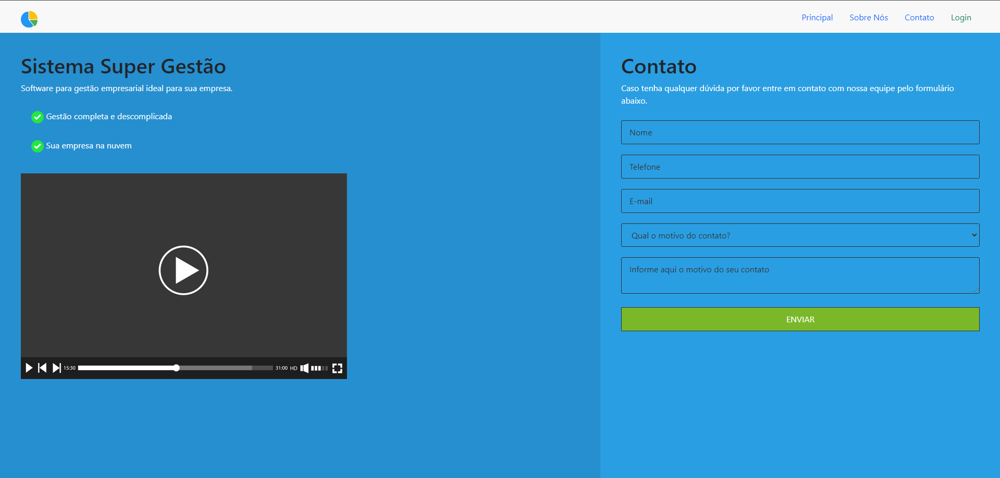

# Super Gestão
### 📝 Projeto pessoal para fins de estudo, se trata de um gerenciador web de pedidos. Possui cadastro de fornecedores, produtos, clientes e pedidos.


## 🛠️ Construído com

* [Laravel](https://laravel.com/) - Framework que gerencia o MVC
* [Bootstrap](https://getbootstrap.com/) - Para deixar estiloso
* [Composer](https://getcomposer.org/) - Para gerenciar as dependência do projeto
* [PHP](https://www.php.net/) - O coração por trás de tudo isso
* [Docker](https://www.php.net/) - Para tudo funcionar com miníma depedência do host

# Instruções para executar o Super Gestão

## Pré-requisitos

Antes de começar, certifique-se de ter o seguinte instalado em seu sistema:

- Docker
- Docker Compose
- Git

## Configuração inicial 🚀

1. Clone este repositório
   
```bash
    git clone https://github.com/WillianMafra/Super-Gestao.git
```

2. Acesse o diretório do projeto.

``` bash
    cd Super-Gestao
```

3. Instale as dependências do Composer.

```docker
    docker run --rm \
        -u "$(id -u):$(id -g)" \
        -v "$(pwd):/var/www/html" \
        -w /var/www/html \
        laravelsail/php83-composer:latest \
        composer install --ignore-platform-reqs
```
4. Crie um alias para facilitar o uso do sail.

```bash
    alias sail='[ -f sail ] && sh sail || sh vendor/bin/sail'
```

5. Renomeie o arquivo .env copy para .env.

```bash
    mv '.env copy' .env
```

6. Inicialize o ambiente docker utilizando o Sail.

```bash
    sail up -d
```

7. Acesse o container da aplicação.

```bash
    sail shell
```
8. Gere uma chave de aplicativo.
   
```bash
    php artisan key:generate
```

9. Execute as migrações do banco de dados.
    
```bash
    php artisan migrate --seed
```

## Acessando a aplicação

Após seguir as etapas acima, o app Super Gestão deve estar em execução e acessível através do navegador da web no seguinte endereço:

```
http://localhost
```

## Encerrando o ambiente Sail

Para parar o ambiente Sail, saia do shell da aplicação digitando 

```bash
    exit
```
e execute o seguinte comando no diretório do projeto:

```bash
sail down
```

---

## Autor 😄
<table>
  <tr>
    <td align="center">
      <a href="https://www.linkedin.com/in/willnmafra/" title="LinkedIn Willian">
        <br>
        <sub>
          <b>Willian Mafra</b>
        </sub>
      </a>
    </td>
  </tr>
</table>
